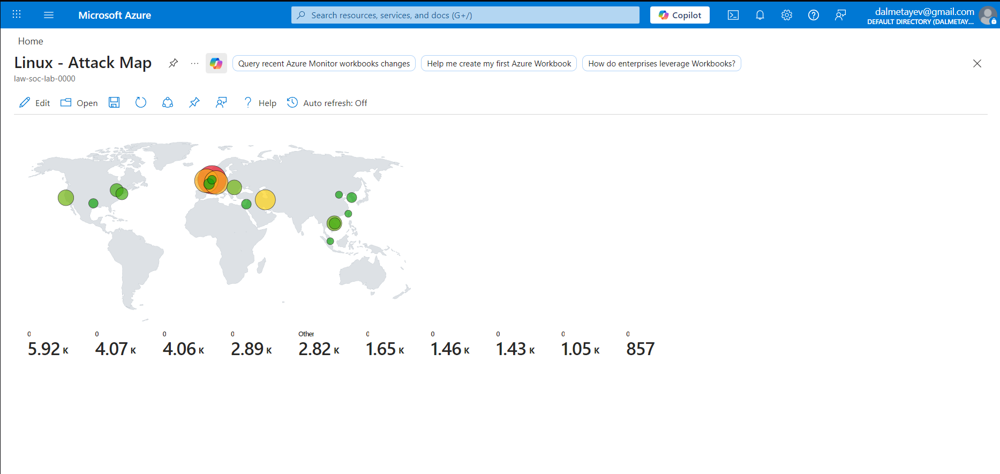
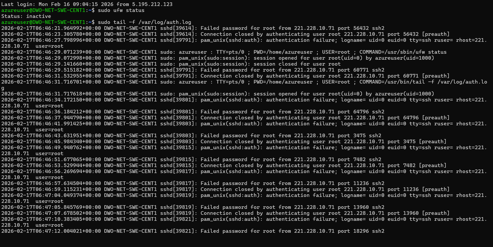
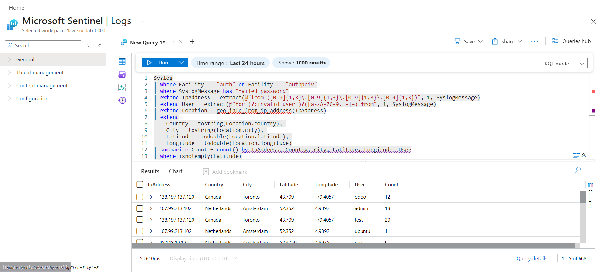
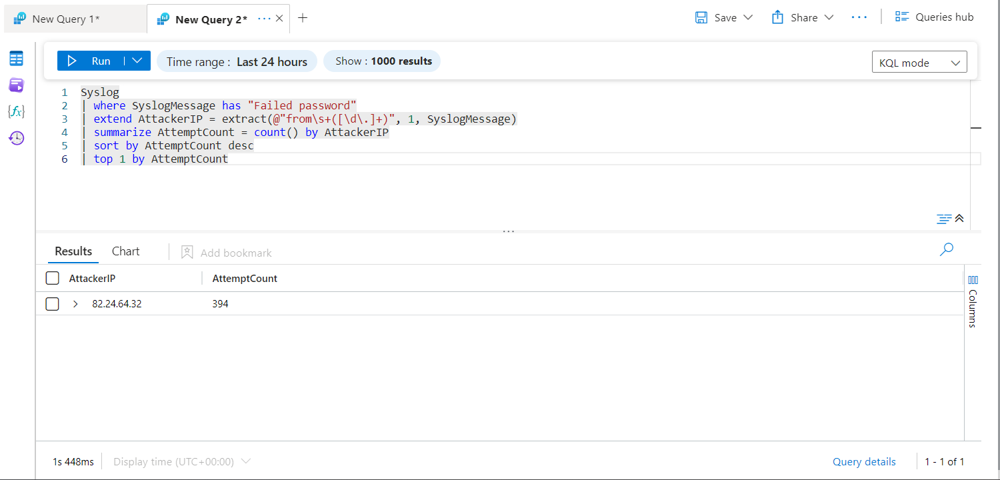

# SIEM Honeypot in Azure (Microsoft Sentinel)

## Overview
This project demonstrates a cloud-based SIEM honeypot built in Microsoft Azure to observe real-world attack activity, analyze security logs, and visualize threat data. The lab focuses on SOC analyst fundamentals such as log monitoring, alerting, and investigation using Microsoft Sentinel.

## Architecture
- Azure Windows Virtual Machine exposed to the public internet
- Network Security Group (NSG) configured to allow inbound traffic
- Log Analytics Workspace for centralized log ingestion
- Microsoft Sentinel used as the SIEM platform

## Tools & Technologies
- Microsoft Azure
- Microsoft Sentinel (SIEM)
- Log Analytics Workspace
- Windows Event Logs (Security)
- KQL queries for log analysis
- Network Security Groups (NSG)

## Workflow Overview
Logs → KQL Queries → Analysis → Global Attack Map Visualization

## Attack Simulation
The Windows VM was intentionally exposed to the internet to attract unauthorized login attempts. Failed authentication events were generated and logged under Windows Security Event ID 4625.

## Detection & Monitoring
- Security logs ingested into Log Analytics
- Microsoft Sentinel configured to monitor authentication failures
- Failed login attempts analyzed using KQL queries
- IP addresses enriched with geolocation data in Sentinel
- Sentinel Workbooks used to visualize global attack sources on a map

## Key Highlights

- **Global Attack Map**  
  

- **Ubuntu Firewall Disabled**  
  

- **KQL Query & Logs**  
  

- **Most Aggressive Attacker**  
  

Additional screenshots, including detailed log results and analysis steps, are available in the `screenshots/` folder.

## Key Skills Demonstrated
- SIEM configuration and monitoring
- Log analysis and investigation
- Windows security event analysis
- Cloud security fundamentals
- Threat intelligence enrichment
- SOC workflow understanding
